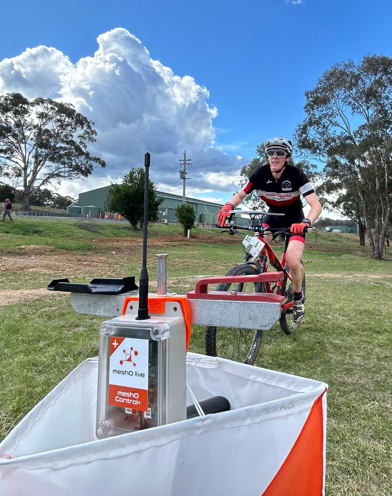

# 🥹 Done

The 2024 MTBO Championships and Carnival were a great success.
Over 200 competitors from all over Australia and New Zealand, and from as far as Great Britain, came to Canberra to compete in five events.
Here are the results, maps, and photos.

## Results, Splits and LiveLox

| Event | Start List| Live Results | Livelox| Official Results |
|-|-|-|-|-|
| E0: Warm-Up | – | <a href="https://liveresultat.orientering.se/followfull.php?lang=en&comp=31547">Live Results</a> | <a href="https://eventor.orienteering.asn.au/Home/RedirectToLivelox?redirectUrl=%2FEvents%2FShow%2F140981">Livelox</a> | <a href="https://eventor.orienteering.asn.au/Events/ResultList?eventId=19686&groupBy=EventClass">Official Results</a> |
| E1: Mass Start| – | <a href="https://liveresultat.orientering.se/followfull.php?lang=en&comp=31548">Live Results</a>  | <a href="https://eventor.orienteering.asn.au/Home/RedirectToLivelox?redirectUrl=%2FEvents%2FShow%2F140982">Livelox</a> | <a href="https://eventor.orienteering.asn.au/Events/ResultList?eventId=19100&groupBy=EventClass">Official Results</a> |
| E2: Middle | <a href="https://eventor.orienteering.asn.au/Events/StartList?eventId=19101&groupBy=EventClass">Start List</a> | <a href="https://liveresultat.orientering.se/followfull.php?comp=31549&lang=en">Live Results</a>  | <a href="https://www.livelox.com/Events/Show/140984/Australian-MTBO-Carnival-Championships-MIDDLE-Stringybark-Hi">Livelox</a> | <a href="https://eventor.orienteering.asn.au/Events/ResultList?eventId=19101&groupBy=EventClass">Official Results</a> |
| E3: Sprint | <a href="https://eventor.orienteering.asn.au/Events/StartList?eventId=19102&groupBy=EventClass">Start List</a> | <a href="https://liveresultat.orientering.se/followfull.php?comp=31550&lang=en">Live Results</a>  | <a href="https://www.livelox.com/Events/Show/140985/Australian-MTBO-Carnival-Championships-SPRINT-Sutton-Road-Dr">Livelox</a> | <a href="https://eventor.orienteering.asn.au/Events/ResultList?eventId=19102&groupBy=EventClass">Official Results</a> |
| E4: Long | <a href="https://eventor.orienteering.asn.au/Events/StartList?eventId=19103&groupBy=EventClass">Start List</a> | <a href="https://liveresultat.orientering.se/followfull.php?comp=31551&lang=sv">Live Results</a>  | <a href="https://eventor.orienteering.asn.au/Home/RedirectToLivelox?redirectUrl=%2FEvents%2FShow%2F140986">Livelox</a> | <a href="https://eventor.orienteering.asn.au/Events/ResultList?eventId=19103&groupBy=EventClass">Official Results</a> |

## Media coverage

::::{grid}
:gutter: 3

:::{grid-item-card} Riotact article

:::
:::{grid-item-card} ABC radio interview

{bdg-warning}`link coming soon`
:::
::::
::::{grid}
:gutter: 3

:::{grid-item-card} ABC News ACT

At `26:19` from the start of `19:00` **ABC News ACT** on `Sunday 20 October 2024`
:::
:::{grid-item-card} ABC article

:::
::::

## Photos

👑 **WARM-UP**
- WARM-UP by John Harding, Part 1: https://www.facebook.com/media/set/?vanity=100063786151610&set=a.1065747835561412
- WARM-UP by John Harding, Part 2: https://www.facebook.com/media/set/?vanity=100063786151610&set=a.1065756798893849
- WARM-UP by John Harding, NZ Team Album: https://www.facebook.com/media/set/?vanity=100063786151610&set=a.1065766068892922

👑 **MASS**
- MASS by John Harding (Start1): https://www.facebook.com/media/set/?vanity=100063786151610&set=a.1066638915472304
-MASS (Start2) by Marina and PRESENTATIONS by Tash Thackray and Arpad Kocsik: https://photos.google.com/share/AF1QipOLnFG0BuRfq832bHNfS6wWi-HI4IwBgR62SYguvI_wnp1vSiPfFuXEALiFI7km7w?key=cXV4eFJkQ2RFQ0Y4WlBTX1NfVzZWX1paeW9pUXFB

👑 **MIDDLE**
- MIDDLE by Kelvin MENG: https://photos.app.goo.gl/CyZV6QbQkBcWRaBk7 (sample, more to come!)
-MIDDLE by Arpad Kocsik: https://photos.google.com/share/AF1QipM0NI-FBEj14q-TNq-qguVaqMZJXOeuzZ9Q0nHczWKxOfEdVxPSYS1yBkWZgTjdMA?key=eG5tTjJlLU14ZDlHY1huZmFDNnhYQ29JLXhDSlFR

👑 **SPRINT**
- SPRINT by John Harding, PART1: https://www.facebook.com/media/set/?vanity=100063786151610&set=a.1067642318705297
- SPRINT by John Harding, PART2: https://www.facebook.com/media/set?vanity=100063786151610&set=a.1067626738706855
- SPRINT by Kelvin MENG: https://photos.app.goo.gl/QMjdzYrwsDgAXmgZ6 (sample, more to come!)

👑 **LONG**
- LONG by John HARDING - PART 1: https://www.facebook.com/media/set/?vanity=100063786151610&set=a.1068270398642489
- LONG by John HARDING - PART 2: https://www.facebook.com/media/set/?vanity=100063786151610&set=a.1068280388641490
- LONG by John HARDING - PART 3: https://www.facebook.com/media/set/?vanity=100063786151610&set=a.1068291385307057
- LONG by John HARDING - PART 4: https://www.facebook.com/media/set/?vanity=100063786151610&set=a.1068301771972685
- LONG by Arpad KOCSIK https://photos.app.goo.gl/eSAySJaKx3uviRE88

::::{grid}
:gutter: 1

:::{grid-item-card}

:::
:::{grid-item-card}

:::
::::
::::{grid}
:gutter: 1

:::{grid-item-card}

:::
:::{grid-item-card}

:::
::::
::::{grid}
:gutter: 1

:::{grid-item-card}

:::
::::
::::{grid}
:gutter: 1

:::{grid-item-card}

:::
::::
::::{grid}
:gutter: 1

:::{grid-item-card}

:::
:::{grid-item-card}

:::
::::

## Maps

### WARM-UP

Score course with 1 pt. for each control and 1 hour to collect as many points as possible.

::::{grid}
:gutter: 1

:::{grid-item-card}

:::
:::{grid-item-card}
:::
:::{grid-item-card}
:::
:::{grid-item-card}
:::
::::

### MASS

In all courses only the first variation is shown out of 8, 4 or 2 for different courses.

**Course 1**

::::{grid}
:gutter: 1

:::{grid-item-card}

:::
:::{grid-item-card}

:::
:::{grid-item-card}

:::
:::{grid-item-card}
:::
::::

**Course 2**

::::{grid}
:gutter: 1

:::{grid-item-card}

:::
:::{grid-item-card}

:::
:::{grid-item-card}

:::
:::{grid-item-card}
:::
::::

**Course 3**

::::{grid}
:gutter: 1

:::{grid-item-card}

:::
:::{grid-item-card}

:::
:::{grid-item-card}

:::
:::{grid-item-card}

:::
::::

**Course 4**

::::{grid}
:gutter: 1

:::{grid-item-card}

:::
:::{grid-item-card}

:::
:::{grid-item-card}

:::
:::{grid-item-card}

:::
::::

**Course 5**

::::{grid}
:gutter: 1

:::{grid-item-card}

:::
:::{grid-item-card}

:::
:::{grid-item-card}

:::
:::{grid-item-card}
:::
::::

**Course 6**

::::{grid}
:gutter: 1

:::{grid-item-card}

:::
:::{grid-item-card}

:::
:::{grid-item-card}
:::
:::{grid-item-card}
:::
::::

**Course 7**

::::{grid}
:gutter: 1

:::{grid-item-card}

:::
:::{grid-item-card}

:::
:::{grid-item-card}
:::
:::{grid-item-card}
:::
::::

**Carnival courses**

::::{grid}
:gutter: 1

:::{grid-item-card}

:::
:::{grid-item-card}

:::
:::{grid-item-card}

:::
:::{grid-item-card}

:::
::::

### MIDDLE

::::{grid}
:gutter: 1

:::{grid-item-card}

Course 1
:::
:::{grid-item-card}

:::
:::{grid-item-card}

Course 2
:::
:::{grid-item-card}

:::
::::
::::{grid}
:gutter: 1

:::{grid-item-card}

Course 3
:::
:::{grid-item-card}

:::
:::{grid-item-card}

Course 4
:::
:::{grid-item-card}

:::
::::
::::{grid}
:gutter: 1

:::{grid-item-card}

Course 5
:::
:::{grid-item-card}

:::
:::{grid-item-card}

Course 6
:::
:::{grid-item-card}

:::
::::
::::{grid}
:gutter: 1

:::{grid-item-card}

Course 7
:::
:::{grid-item-card}

:::
:::{grid-item-card}
:::
:::{grid-item-card}
:::
::::

**Carnival courses**

::::{grid}
:gutter: 1

:::{grid-item-card}

:::
:::{grid-item-card}

:::
:::{grid-item-card}

:::
:::{grid-item-card}

:::
::::

### SPRINT

::::{grid}
:gutter: 1

:::{grid-item-card}

:::
:::{grid-item-card}

:::
:::{grid-item-card}

:::
:::{grid-item-card}

:::
::::
::::{grid}
:gutter: 1

:::{grid-item-card}

:::
:::{grid-item-card}

:::
:::{grid-item-card}

:::
:::{grid-item-card}

:::
::::
::::{grid}
:gutter: 1

:::{grid-item-card}

:::
:::{grid-item-card}

:::
:::{grid-item-card}

:::
:::{grid-item-card}
:::
::::
::::{grid}
:gutter: 1

:::{grid-item-card}

:::
:::{grid-item-card}

:::
:::{grid-item-card}

:::
:::{grid-item-card}

:::
::::

### LONG

::::{grid}
:gutter: 1

:::{grid-item-card}

:::
:::{grid-item-card}

:::
:::{grid-item-card}

:::
:::{grid-item-card}

:::
::::
::::{grid}
:gutter: 1

:::{grid-item-card}

:::
:::{grid-item-card}

:::
:::{grid-item-card}

:::
:::{grid-item-card}

:::
::::
::::{grid}
:gutter: 1

:::{grid-item-card}

:::
:::{grid-item-card}

:::
:::{grid-item-card}

:::
:::{grid-item-card}

:::
::::
