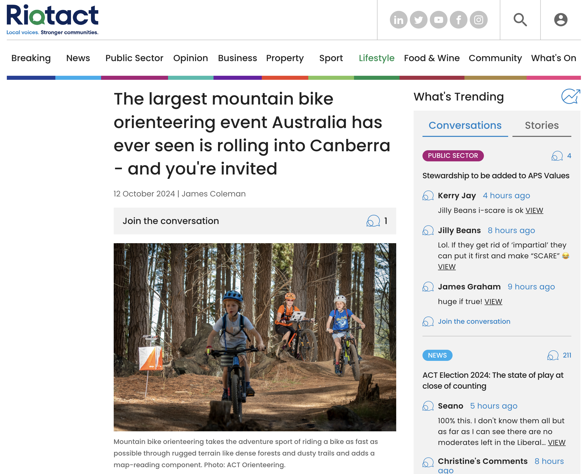

# 🥹 Done

The 2024 MTBO Championships and Carnival were a great success.
Over 200 competitors from all over Australia and New Zealand, and from as far as Great Britain, came to Canberra to compete in five events.
Here are the results, maps, and photos.

## Results, Splits and LiveLox

| Event | Start List| Live Results | Livelox| Official Results |
|-|-|-|-|-|
| E0: Warm-Up | – | <a href="https://liveresultat.orientering.se/followfull.php?lang=en&comp=31547">Live Results</a> | <a href="https://eventor.orienteering.asn.au/Home/RedirectToLivelox?redirectUrl=%2FEvents%2FShow%2F140981">Livelox</a> | <a href="https://eventor.orienteering.asn.au/Events/ResultList?eventId=19686&groupBy=EventClass">Official Results</a> |
| E1: Mass Start| – | <a href="https://liveresultat.orientering.se/followfull.php?lang=en&comp=31548">Live Results</a>  | <a href="https://eventor.orienteering.asn.au/Home/RedirectToLivelox?redirectUrl=%2FEvents%2FShow%2F140982">Livelox</a> | <a href="https://eventor.orienteering.asn.au/Events/ResultList?eventId=19100&groupBy=EventClass">Official Results</a> |
| E2: Middle | <a href="https://eventor.orienteering.asn.au/Events/StartList?eventId=19101&groupBy=EventClass">Start List</a> | <a href="https://liveresultat.orientering.se/followfull.php?comp=31549&lang=en">Live Results</a>  | <a href="https://www.livelox.com/Events/Show/140984/Australian-MTBO-Carnival-Championships-MIDDLE-Stringybark-Hi">Livelox</a> | <a href="https://eventor.orienteering.asn.au/Events/ResultList?eventId=19101&groupBy=EventClass">Official Results</a> |
| E3: Sprint | <a href="https://eventor.orienteering.asn.au/Events/StartList?eventId=19102&groupBy=EventClass">Start List</a> | <a href="https://liveresultat.orientering.se/followfull.php?comp=31551&lang=en">Live Results</a>  | <a href="https://www.livelox.com/Events/Show/140985/Australian-MTBO-Carnival-Championships-SPRINT-Sutton-Road-Dr">Livelox</a> | <a href="https://eventor.orienteering.asn.au/Events/ResultList?eventId=19102&groupBy=EventClass">Official Results</a> |
| E4: Long | <a href="https://eventor.orienteering.asn.au/Events/StartList?eventId=19103&groupBy=EventClass">Start List</a> | <a href="https://liveresultat.orientering.se/followfull.php?comp=31551&lang=sv">Live Results</a>  | <a href="https://eventor.orienteering.asn.au/Home/RedirectToLivelox?redirectUrl=%2FEvents%2FShow%2F140986">Livelox</a> | <a href="https://eventor.orienteering.asn.au/Events/ResultList?eventId=19103&groupBy=EventClass">Official Results</a> |

## Maps

{bdg-warning}`coming soon`

## Media coverage

::::{grid}
:gutter: 3

:::{grid-item-card} Riotact article

:::
:::{grid-item-card} ABC radio interview

{bdg-warning}`link coming soon`
:::
::::
::::{grid}
:gutter: 3

:::{grid-item-card} ABC News ACT

At `26:19` from the start of `19:00` **ABC News ACT** on `Sunday 20 October 2024`
:::
:::{grid-item-card} ABC article

:::
::::

## Photos

{bdg-warning}`coming soon`