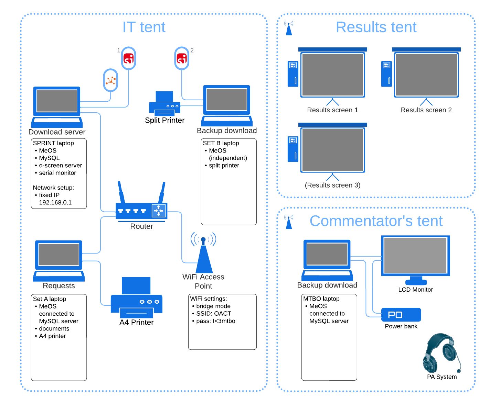

# 💻 IT setup and notes

This page contains the information for the **IT team**.

- People: [IT team](people:computers)
- Time: follow [schedule](schedule:warmup) for the `IT team` on each day
- Tools: see the full list of [equipment](equipment:it)
- Join [IT team WhatsApp group](https://chat.whatsapp.com/D8x4pE5UoyO8gaRAwYkL3r)

(computers:scematic)=
## Schematic for the Carnival IT setup




## Technical notes


### Network setup

**Router NETGEAR AC1200**

- IP `192.168.0.1`
- user `admin`
- pass `1111`
- WiFi is disabled

**Access point**

- To be fixed to the tent pole
- Power over Ethernet (PoE) injector with power adapter
- DHCP assigned IP
- SSID `MTBO`
- WPA2-PSK `I<3mtbo!`

### Computers setup

**SPRINT "Download server" laptop**

- Fixed IP `192.168.0.10`
- MeOS in network mode
- MySQL database
  * Address: `192.168.0.10:3306`
  * pass `OACT`
- Competition information is stored in MySQL database
- Results export + oScreen scripts for display
- oScreen parser-and-server (see setup below)
- serial monitor for meshO diagnostics log (see setup below)

> TODO: Upload competition to the MySQL database

**OACT21 "Enquiries" laptop**

- MeOS in network mode
- Connect to MySQL database on the SPRINT "Download server" laptop
- Online results (see setup below)

**OACT22 "Backup download" laptop**

- Independent stand-alone MeOS instance

**MTBO Acer Spin laptop**

- MeOS in network mode
- Connect to MySQL database on the SPRINT "Download server" laptop
- Announcer screen in MeOS

### oScreen setup

> TODO: Add setup instructions for the server

Setup on the screens:

- URL: `http://192.168.0.10:5000?kiosk_id=NNN`

### Online results

Online results are to be set up on OACT21 "Enquiries" laptop.

- Start `Online Results` service in MeOS
- Run every 15 sec
- Dropdown: `MeOS Online Protocol XML 2.0`
- Check `Compress large files` and `Send to the web URL` and nothing else
- Fill out competition ID and Password
- URL `https://www.melin.nu/online/emma/emmaupdate.php`
- Competition IDs:
  * Warm-up: 31547
  * Mass: 31548
  * Sprint: 31550
  * Middle: 31549
  * Long: 31551
- Password: `I<3mtbo`

### meshO diagnostics setup

- Radio meshO Prime unit is to be connected to the SPRINT "Download server" laptop
- The unit provides two COM interfaces: 
  1. For MeOS punch import, appears as SI dongle
  2. For diagnostics log, VS Code serial monitor can be used to monitor the log

- In addition, a separate meshO Diagnostics unit can be connected to a separate laptop where Digi XCTU software can be used to diagnose the mesh network
- Tate will run these diagnostics

## Rented SI-Air sticks numbers

**From Orienteering ACT**

`8581175` `8581176` `8581177` `8581178` `8581179` `8581180` `8581181` `8581182` `8581183` 
`8581184` `8581185` `8581186` `8581187` `8581188` `8581189` `8581190` `8581191` `8581192` 
`8581193` `8581194` `8625439` `8633229` `8635973` `8635984` `8636015` `8636023` `8643872` 
`8643888` `8643903` `8643912` `8652477` `8652481` `8652483` 

```{button-link} _static/lists/rented_sticks_oact.csv
:color: primary
:outline:

csv file
```

**From Orienteering Australia**

`8237655` `8237674` `8237688` `8516219` `8516246` 

```{button-link} _static/lists/rented_sticks_oa.csv
:color: primary
:outline:

csv file
```

**From Craig Steffens**

`8510855` `8510856` `8510857` `8510858` `8510859` `8510860` `8510861` `8510862` `8510863` 
`8511702` `8511703` `8511705` `8511706` `8511715` `8512539` `8512543` `8512545` `8512546` 
`8512547` `8512549` 

```{button-link} _static/lists/rented_sticks_oqld.csv
:color: primary
:outline:

csv file
```

**From Colin Price**

`8627351` `8635903` `8635904` `8635907` `8635933` `8635936` `8635945` `8635948` `8635950` 
`8635951` `8635957` `8635958` `8635959` `8635965` `8635966` `8635975` `8635993` `8635996` 
`8636014` `8636020` `8636022` `8636027` `8636032` `8636036` `8636038` `8636039` `8636042` 
`8636045` `8636047` `8636567` `8639403` `8639405` `8639407` `8639414` `8639416` `8639417` 
`8639418` `8639420` `8639421` `8639423` `8639425` `8639426` `8639430` `8639432` `8639433` 
`8639436` `8639439` `8639440` `8639441` `8639442` `8639446` `8639448` `8639449` `8652453` 

```{button-link} _static/lists/rented_sticks_colin_price.csv
:color: primary
:outline:

csv file
```

## Known changes to be made in MeOS event data

| Competitor | Class | Change |
|:-|:-:|:-|
| Niki Hale | W50 | LONG: W50 --> Score |
| Peter Mitches | M50 | M50 --> M40 |
| Ken Young | | not hired SIAC --> `8524589` |
| Skelton, Andrew | | SIAC --> `8011658` |
| Pat Kham... Phet | | SIAC --> `8512539` |
| Thomas Carrol | | hired SIAC --> `8510856` |
| Jason Rutkowski | | SIAC --> `8510862` |
| Garrick Larkin | | SIAC --> `8512546` |
| Sue Duckett | | SIAC --> `8511702` |
| Nicholas Hall | | SIAC --> `8523580` |
| Arlo Axlee | | SIAC --> `8523600` |
| Bandi, Narasimha Rao | | SIAC --> `8512545` |

| Stephanie Farrant | W40 | Club --> Peninsula and Plains |
| Timothy Farrant | M21 | Club --> Peninsula and Plains |
| Nicola Mitchell | W50 | --> Hutt Valley |
| Peter Mitchell | M40 | Club --> Hutt Valley |
| Liam Drew | M40 | Club --> Hutt Valley |
| Andrew McNeill | M60 | Club --> Taranaki |
| Jason Rutkowski | M21 | Club --> CAS N |
| Lucy Mackie | W21 | Club --> CAS N |
| Tomas Krajca | M21 | Club --> CAS A |
| David Simpfendorfer | M50 | Club --> CAS A |
| Trevor Jacobs | M70 | Club --> CAS A |
| Murray Withers | M60 | Club --> ? |
| Karena Hanley | W60 | Club --> ? |
| Duncan Ledger | M21 | Club --> ? |

> TODO: Find the missing clubs

People who were absent in Eventor on WarmUp (and had unknown SIAC numbers):
- Mortimer, Anne, W60
- Metherell, Alister, M60
- Greg Barbour, M50
- Pyatt, Steve, M60

