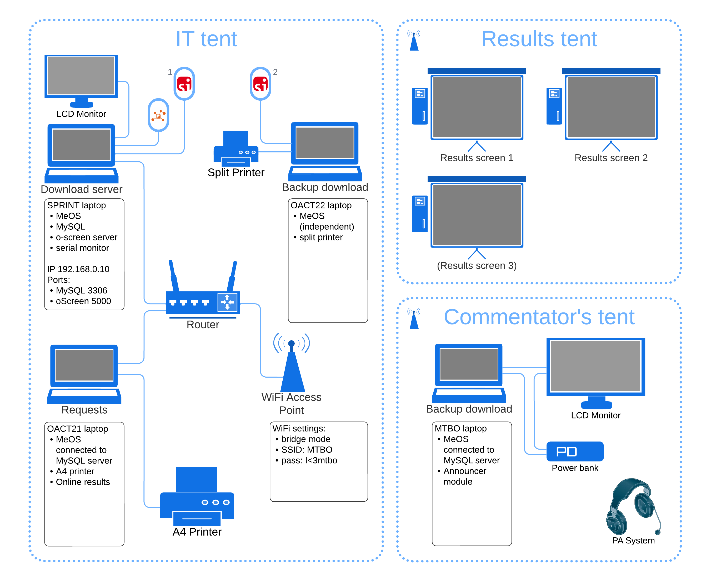

# 💻 IT setup and notes

This page contains the information for the **IT team**.

- People: [IT team](people:computers)
- Time: follow [schedule](schedule:warmup) for the `IT team` on each day
- Tools: see the full list of [equipment](equipment:it)
- Join [IT team WhatsApp group](https://chat.whatsapp.com/D8x4pE5UoyO8gaRAwYkL3r)

(computers:scematic)=
## Schematic for the Carnival IT setup

## Technical notes

### Network setup

**Router NETGEAR AC1200**

Internal admin panel
- IP `192.168.0.1`
- user `admin`
- pass `1111` 

Fixed IP addresses:
- `192.168.0.10` - SPRINT "Download server" laptop

**Access point**

- To be fixed to the tent pole
- Power over Ethernet (PoE) injector with power adapter
- IP ?

### Computers setup

**SPRINT "Download server" laptop**

- MeOS in network mode
- MySQL database
  * Address: `192.168.0.10:3306`
  * pass `OACT`
- Competition information is stored in MySQL database
- Results export + oScreen scripts for display
- oScreen parser-and-server (see setup below)
- serial monitor for meshO diagnostics log (see setup below)

> TODO: Upload competition to the MySQL database beforehand

**OACT21 "Enquiries" laptop**

- MeOS in network mode
- Connect to MySQL database on the SPRINT "Download server" laptop
- Online results (see setup below)

**OACT22 "Backup download" laptop**

- Independent stand-alone MeOS instance

**MTBO Acer Spin laptop**

- MeOS in network mode
- Connect to MySQL database on the SPRINT "Download server" laptop
- Announcer screen in MeOS

### oScreen setup

> TODO: Add setup instructions for the server

Setup on the screens:

- URL: `http://192.168.0.10:5000?kiosk_id=NNN`

### Online results

Online results are to be set up on OACT21 "Enquiries" laptop.

- Start `Online Results` service in MeOS
- Run every 15 sec
- Check
- 
- URL `https://www.melin.nu/online/emma/emmaupdate.php`
- Competition IDs:
  * Warm-up: 31547
  * Mass: 31548
  * Sprint: 31550
  * Middle: 31549
  * Long: 31551
- Password: `I<3mtbo`

### meshO diagnostics setup

- Radio meshO Prime unit is to be connected to the SPRINT "Download server" laptop
- The unit provides two COM interfaces: 
  1. For MeOS punch import, appears as SI dongle
  2. For diagnostics log, VS Code serial monitor can be used to monitor the log

- In addition, a separate meshO Diagnostics unit can be connected to a separate laptop where Digi XCTU software can be used to diagnose the mesh network
- Tate will run these diagnostics
