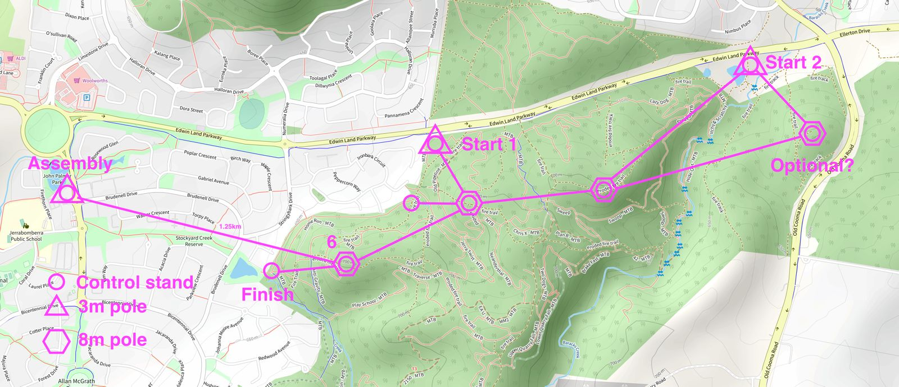
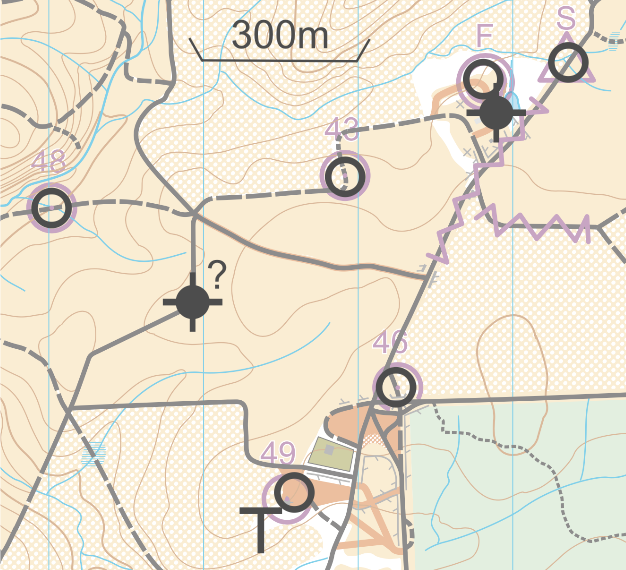

# 📡 meshO radio controls setup

## WARM-UP

Warm-up event has one common score course: we will have radios only on start and finish.  
Perhaps, meshO Boost unit will be needed to bring the signal through the tunnel.

- 2x meshO Controls
- 2x meshO Boost
- 8m mast at the IT tent

## MASS

- 5x meshO Controls
- 2x meshO Boost
- 8m mast at the IT tent
- 3m mast to relay the signal over the crest of the hill

### Actual allocation for MASS

Ctl #2 is the Finish, close to the tent

Ctl #44 is actually #300 (known meshO bug that I need to fix… I’m only looking at the 2nd byte atm). It was over the rise, so makes sense that signal wasn’t great to Prime.

#111 was over a bit of a rise, explaining the medium signal to #300, but quite close to #84 up the gully on the road bend.

#106 was at the top track junction, only just a bit further away from #300 than #83, but with a big spur in the way.

## MIDDLE

- 5x meshO Controls
- 4x meshO Boost
- 3x 8m masts on the hills
 - 3x 3m masts at IT tent, start 1 and start 2

## SPRINT

- 8x meshO Controls
- 2x meshO Boost
- 2x 8m masts at the IT tent and the hill

## LONG

- 6x meshO Controls
- 3x meshO Boost
- 2x 8m masts at the IT tent and the hill
- 3m mast at the old water tower

