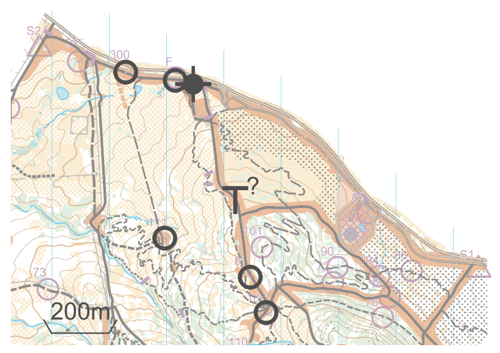
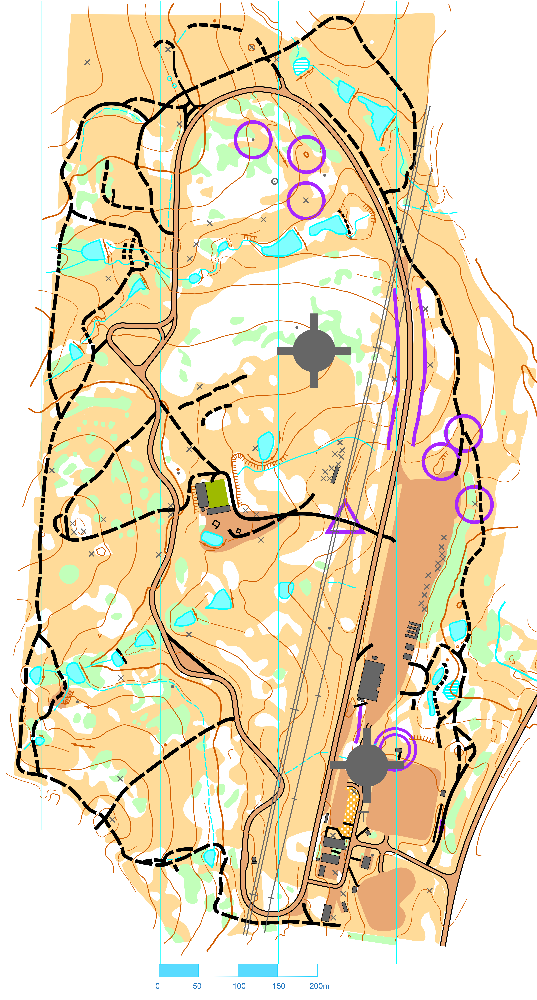

# 📡 meshO radio controls setup

#### WARM-UP

Warm-up event has one common score course: we will have radios only on start and finish.  
Perhaps, meshO Boost unit will be needed to bring the signal through the tunnel.

- 2x meshO Controls
- 2x meshO Boost
- 8m mast at the IT tent

#### MASS

- 5x meshO Controls
- 2x meshO Boost
- 8m mast at the IT tent
- 3m mast to relay the signal over the crest of the hill

#### MIDDLE

- 5x meshO Controls
- 4x meshO Boost
- 3x 8m masts on the hills
 - 3x 3m masts at IT tent, start 1 and start 2

#### SPRINT

- 8x meshO Controls
- 2x meshO Boost
- 2x 8m masts at the IT tent and the hill

#### LONG

- 6x meshO Controls
- 3x meshO Boost
- 2x 8m masts at the IT tent and the hill
- 3m mast at the old water tower

