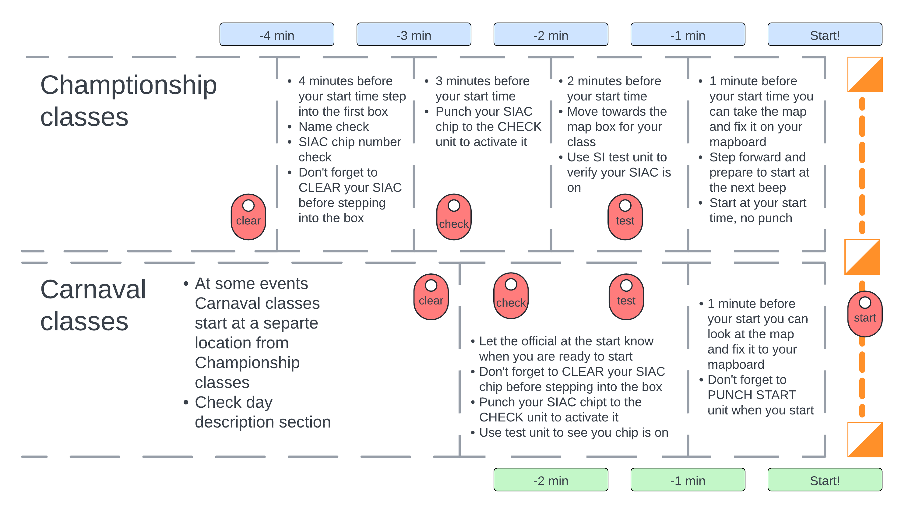

# 🚀 Start and finish

This page contains the information for the **Start team**.

- People: [Start team](people:start)
- Time: follow [schedule](schedule:warmup) for the `Start team` on each day
- Tools: see the full list of [equipment](equipment:start)

## Functions of the start team

The main function of the start team is to ensure fairness of the competition by providing smooth and well functioning start process.  The team should:

- follow the [schedule](schedule:warmup) for the `start team` on each day
- set up [start equipment](equipment:start) and bunting 
- implement start arrangement for each event (mass, middle, sprint, long) according to the diagrams
- manage the start process according to the bulletin and the competition rules ([documents](home:documents))
- pack up the start equipment and get ready for the next event
- use own transport to move equipment between events
- *MIDDLE event has two separate starts for Championship and Carnival*
- *relocation between MIDDLE and SPRINT events should happen right after the start is closed*

## Schematic for the start setup

The following diagram shows the overall setup of the start area and process for MIDDLE, SPRINT and LONG events.  MASS has a separate start setup, see below, and WARM-UP is a simple queueing setup with `punch start`.

- Championship classes have allocated start times
- Carnival classes have `punch start` and can start any time within the start window
- MIDDLE event has two separate starts for the two groups of classes, other events should have the two starts side-by-side, but function independently
- Schematic should be adjusted to the layout of the start area in each event
- The start area should be clearly marked with bunting and signs, see equipment list

## Technical notes

### Setup and checking SI units at the start

### Setup of start clock
