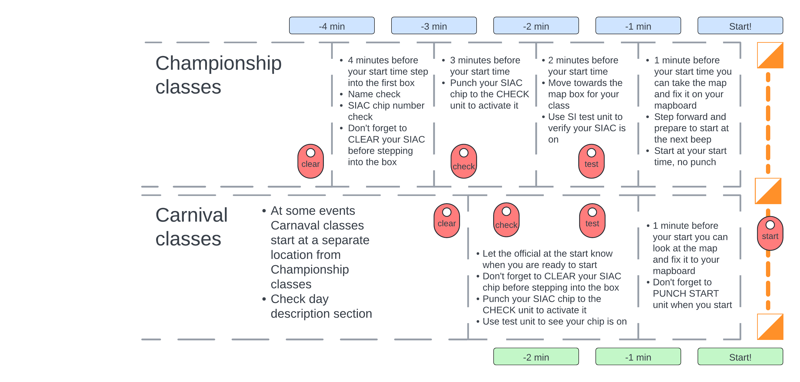

# 🚀 Start and finish

This page contains the information for the **Start team**.

- People: [Start team](people:start)
- Time: follow [schedule](schedule:warmup) for the `Start team` on each day
- Gear: see the full list of [equipment](equipment:start)

## Functions of the start team

The main function of the start team is to ensure fairness of the competition by providing smooth and well functioning start process.  The team should:

- follow the [schedule](schedule:warmup) for the `start team` on each day
- set up [start equipment](equipment:start) and bunting 
- implement start arrangement for each event (mass, middle, sprint, long) according to the diagrams
- manage the start process according to the bulletin and the competition rules ([documents](home:documents))
- pack up the start equipment and get ready for the next event
- use own transport to move equipment between events
- *MIDDLE event has two separate starts for Championship and Carnival*
- *relocation between MIDDLE and SPRINT events should happen right after the start is closed*

## Schematic for the start setup

The following diagram shows the overall setup of the start area and process for MIDDLE, SPRINT and LONG events.  MASS has a separate start setup, see below, and WARM-UP is a simple queueing setup with `punch start`.

- Championship classes have allocated start times
- Carnival classes have `punch start` and can start any time within the start window
- MIDDLE event has two separate starts for the two groups of classes, other events should have the two starts side-by-side, but function independently
- Schematic should be adjusted to the layout of the start area in each event
- The start area should be clearly marked with bunting and signs, see equipment list

## Gear and equipment

- Each of the two starts has a 3x3m tent, small table and two chairs
- The table with the map boxes should be placed under the tent, with two lanes for the competitors on both sides of the table
- Bunting and pigtail stakes should used to mark the start corridor, the minute boxes can be marked by staking the bunting to the ground
- The route to the start triangle flag should be marked unless visible from the start tent

## Technical notes

### SI units at the start

- SI units should be arranged in a visible sequence: CLEAR - CHECK - TEST - START (for Carnival classes)
- CLEAR, CHECK and START units have to be punched (the chip inserted until the beep)
- TEST unit is there to test whether the chip is working in the radio module --- competitors should just wave over the unit. The range of the test unit is 30cm, whereas all units on the course have a range of 1.5m
- The most important unit is CHECK: it turns on the SI-Air chip, IT team uses this punch as evidence that a competitor is in the forest
- **CHECK unit should be held by a start official, and manually given to each competitor as they pass to -3 minutes box**
- In the Carnival classes it is crucial for the start official to make sure the competitors punch START before beginning their course. In groups going through the course together every chip has to be punched at the START unit.
- All SI inits should be time-synced and properly set up before the start. They are turned on by inserting SI chip into the unit until the beep. The units should be turned off using special "service off" card after start closes.

### meshO radio units at the start

- Blue SI units with short range radio (SRR) should be used for CHECK and punch START
- meshO radio unit should be placed **within 4-5m from the CHECK unit**, and ideally at the same distance from the punch START unit
- there will be one meshO unit for Championship and one meshO unit for Carnival starts
- meshO units are turned on by sliding a magnet along the left side of the unit away from the antenna, and turned off by sliding the magnet towards the antenna

### Setup of start clock

- to be added