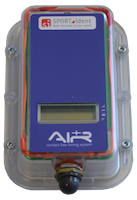

# 🧭 Info for course setters

## Allocation of control numbers for the events

**BS11 units Available**
| Set | Range | Quantity | Notes |
|-|-:|:-:|-|
| OACT | 31-70 | 40-1 | #70 bad battery |
| OA | 71-109 | 39 | |
| ONSW | 190-203<br/>205-224<br/>300-304 | 39 | |


**Allocation to events**
| Event | N of controls | Allocated numbers | Set | Comments |
|-|:-:|-|-|-|
| WARM-UP | 20 | 205-224 | ONSW | |
| MASS | 38 | 71-88, 90-97, 99,<br/>101-111, 300 | OA, ONSW | 110,111 do not exist<br/>need to be reprogrammed<br/>from 301,302 |
| MIDDLE | 39 | 31-68, 69 | OACT, | |
| SPRINT | 44 | 71-86, 190-197,<br/>205-224 | OA, ONSW |  |
| LONG | 27 | 31-57 | OACT | |

(setting:logistics)=
## Control stands, flags and SI unit logistics

```{button-ref} equipment:course-setting
:color: primary
:shadow:

All course-setting gear
```

**OACT has in operation:**
- 293 control flags (*more that the total number of controls in the Carnival*)
- 143 control stands with large baseplates (BSF7 and BS11BS)
  * Plus BSF8 plated – 20
  * Minus 9 stands in repair
- 5 setters' vests + 2 belts to carry SI units

**Logistic plan for control flags, stands and SI units:**

- all SI units are set by Fedor before handing them out

| Date | Time | From | Operation |
|-|-|-|-|
| *Wed, Oct 16* | morning | Shed | 38 stands + flags $\longrightarrow$ Cathy for MASS |
| *Wed, Oct 16* | morning | Shed | 20 stands + flags $\longrightarrow$ Marina for WARMUP |
| *Wed, Oct 16* | evening | FM garage | MASS units + vest $\longrightarrow$ Cathy |
| *Thur, Oct 17* | early morning | FM garage | WARMUP units + vest $\longrightarrow$ Marina |
| *Thur, Oct 17* | morning | Shed | 44 stands + flags $\longrightarrow$ Cath for SPRINT |
| *Thur, Oct 17* | morning | Shed | ? Units 190-197 $\longrightarrow$ Cath for SPRINT |
| *Thur, Oct 17* | morning | Shed | 39 stands + flags $\longrightarrow$ Michael for MIDDLE |
| *Thur, Oct 17* | morning | Shed | MIDDLE units + vest $\longrightarrow$ Michael |
| | | | 143 - (38+20+44+39) = 2 stands remain in the Shed<br/>All repairs will be complete<br/>Plus meshO has about 5 stands |
| *Thur, Oct 17* | evening | WARMUP | Units 205-224 $\longrightarrow$ Cath for SPRINT |
| *Thur, Oct 17* | evening | WARMUP | 20 stands + flags $\longrightarrow$ Fedor for LONG |
| *Thur, Oct 17* | evening | Shed, meshO | 2 stands + flags $\longrightarrow$ Fedor for LONG |
| *Fri, Oct 18* | evening | MASS | Units 71-88 + vest $\longrightarrow$ Cath for SPRINT |
| *Fri, Oct 18* | evening | MASS | 38 stands + flags $\longrightarrow$ FM garage |
| *Sat, Oct 19* | afternoon | MIDDLE | 39 stands + flags $\longrightarrow$ FM garage |
| *Sat, Oct 19* | afternoon | MIDDLE | MIDDLE units + vest $\longrightarrow$ FM garage |
| *Sat, Oct 19* | evening | SPRINT | 44 stands + flags $\longrightarrow$ FM garage |
| *Sat, Oct 19* | evening | SPRINT | SPRINT units + vest $\longrightarrow$ FM garage |
| *Sun, Oct 20* | early morning | FM garage | LONG units + vest $\longrightarrow$ Fedor |
| *Sun, Oct 20* | afternoon | LONG | 28 stands + flags $\longrightarrow$ FM garage |
| *Sun, Oct 20* | afternoon | LONG | LONG units + vest $\longrightarrow$ FM garage |
| *Sun, Oct 20* | evening | FM garage | 143 stands + flags $\longrightarrow$ OACT shed |

(setting:hard_ground)=
## Putting control stands into the hard ground

The main goal in placing the controls in the terrain is that the competitors can ride by the control without stopping.

Many times the ground is too hard for the control stand to be placed in such position.
Possible strategies:

- Try to find a softer spot, but such that comeptitors can still ride by without stopping
- Use steel stake and hammer to make a hole in the ground, then place control stand in the hole
- Use rocks to create a small mound around the control stand which should hold it upright

The {bdg-success}`best` working strategy proved to be:
- Use **battery powered drill with 10mm masonry bit** to make a hole in the ground, 8-12cm deep
- Use standard hammer (not mallet) or a rock to hammer the control stand into the hole
- Use the same instrument to ram the ground around the control
This technique works even in the hardest ground including sandstone rock as shown in tests.


## SI units



- We will be using BS11 units that are SI-Air only units with 1.5m range
- The unit is turned on and off *by magnet* by applying it to the side next to I/O symbol

```{admonition} Activating BS11 units
:class: caution

The units can not be activated by the competitors!  
It is very important that the unit is turned on by the setter using the special magnetic stick.
```


