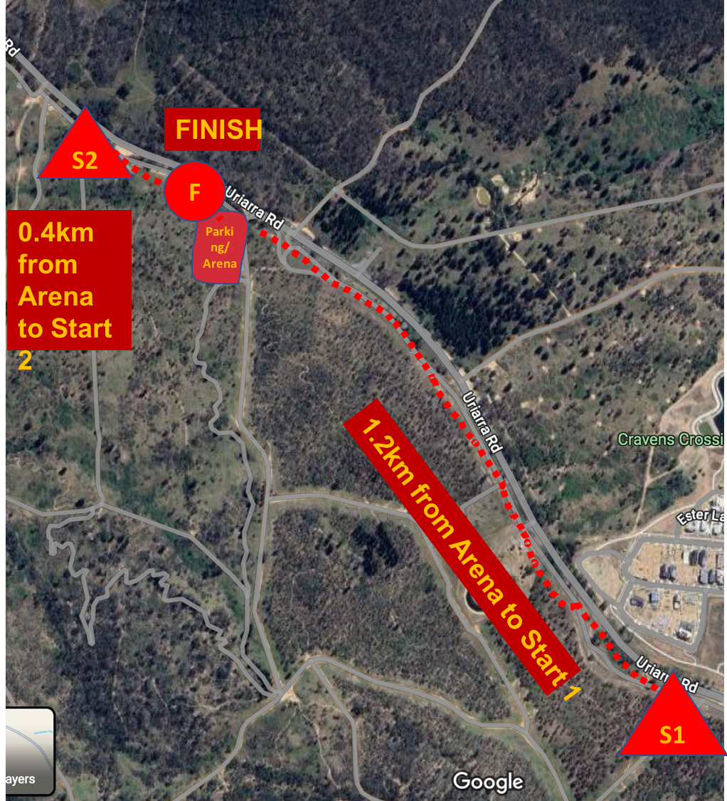

# 🚴‍♀️ MASS: Friday, Oct 18

| **Oct 18, Friday** | | |
|--|--|--|
| 15:00 | 🎪 Event center opens | [Location](https://maps.app.goo.gl/caWZitWLByRsVxT79) |
| 16:30 - 17:00 | 🚴‍♀️ MASS start window | |
| 19:00 | 🏁 Course closure | |
| 18:45 | 🏆 Presentation ceremony for MASS | |

```{button-ref} schedule:mass
:color: primary
:shadow:

Check the time that you have to arrive in the detailed schedule here
```

(event-location:mass)=
## Arena location

```{button-link} http://maps.google.com/maps?saddr=&daddr=-35.299868311476324,149.00779586067725
:color: primary
:shadow:

Driving directions
```

<iframe src="https://www.google.com/maps/embed?pb=!1m14!1m12!1m3!1d1593.1410105502746!2d149.00774391295286!3d-35.29995967991034!2m3!1f0!2f0!3f0!3m2!1i1024!2i768!4f13.1!5e1!3m2!1sen!2sau!4v1728899218398!5m2!1sen!2sau" width="600" height="450" style="border:0;" allowfullscreen="" loading="lazy" referrerpolicy="no-referrer-when-downgrade"></iframe>

(arena-diagram:mass)=
## Arena setup for MASS


(start-location:middle)=
## Start and finish locations for MASS


