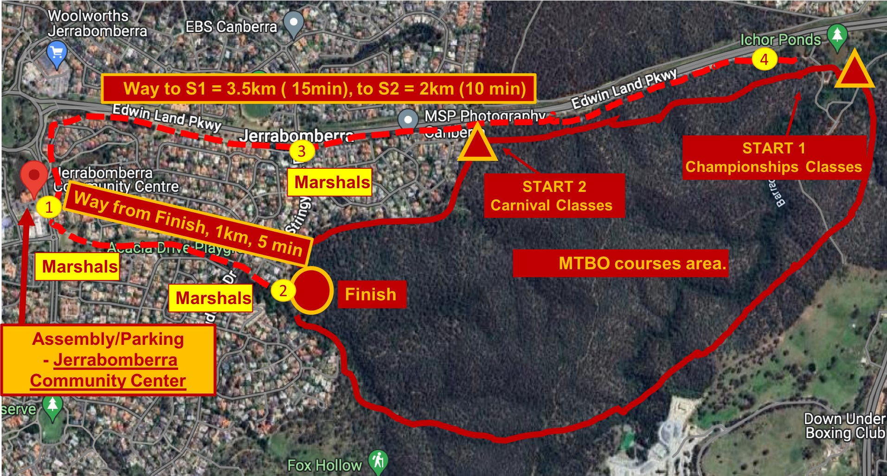

# 🚴‍♀️ MIDDLE: Saturday, Oct 19

Buckle up! {bdg-success}`Two events` in one day + dinner!

| **Oct 19, Saturday** | | |
|--|--|--|
| 7:30 | 🎪 Event center opens | [Location](https://maps.app.goo.gl/2cXzt4ywia9G6Hj77) |
| 8:30 - 10:00 | 🚴‍♀️ MIDDLE start window | |
| 12:00 | 🏁 Course closure 🏁, arena relocation | |
| 1 pm | 🎪 Event center opens | [Location](https://maps.app.goo.gl/PX7dE2mznda9W7Q49) |
| 14:00 - 15:30 | 🚴‍♀️ SPRINT start window | |
| 16:30 | 🏁 Course closure 🏁 | |
| 18:30 - 21:30 | 🍷 DINNER at *Harmonie German Club* | [Location](https://maps.app.goo.gl/RzJVPCCobYroMax18) |
| 19:30 | 🏆 Presentation ceremony for MIDDLE and SPRINT | |

```{button-ref} schedule:middle
:color: primary
:shadow:

Check the time that you have to arrive in the detailed schedule here
```

(event-location:middle)=
## Arena location

Note that MASS has `remote` arena: start 1, start 2 and finish are in different locations.  

```{button-link} http://maps.google.com/maps?saddr=&daddr=-35.385162710777166,149.20046276008077
:color: primary
:shadow:

Driving directions
```

<iframe src="https://www.google.com/maps/embed?pb=!1m14!1m12!1m3!1d1094.3817203351475!2d149.200290006707!3d-35.38525650839704!2m3!1f0!2f0!3f0!3m2!1i1024!2i768!4f13.1!5e1!3m2!1sen!2sau!4v1728899476469!5m2!1sen!2sau" width="600" height="450" style="border:0;" allowfullscreen="" loading="lazy" referrerpolicy="no-referrer-when-downgrade"></iframe>

(arena-diagram:middle)=
## Arena setup for MIDDLE


(start-location:middle)=
## Start and finish locations for MIDDLE

