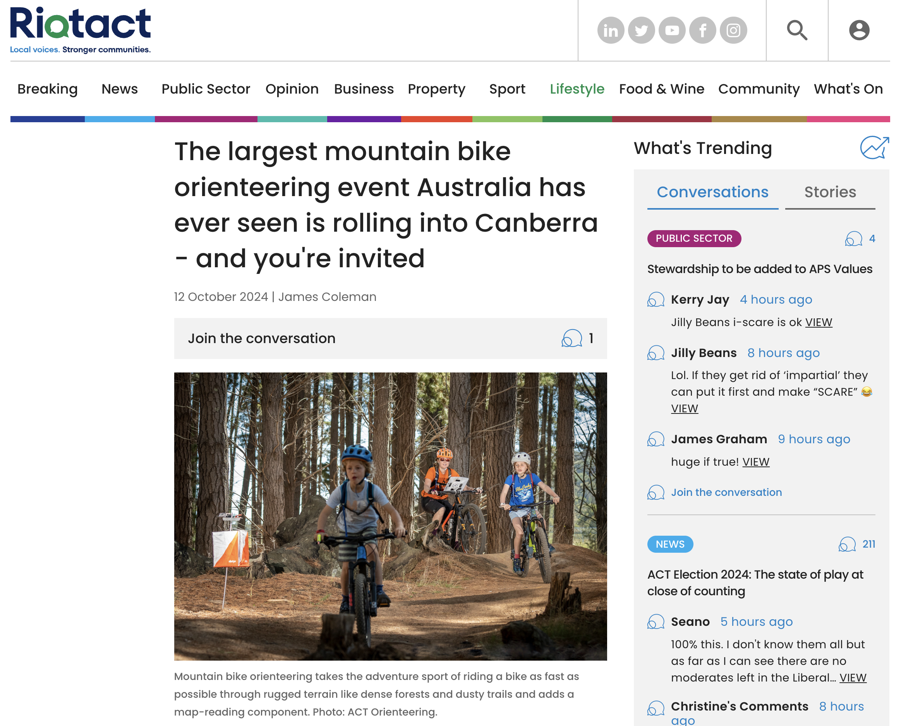
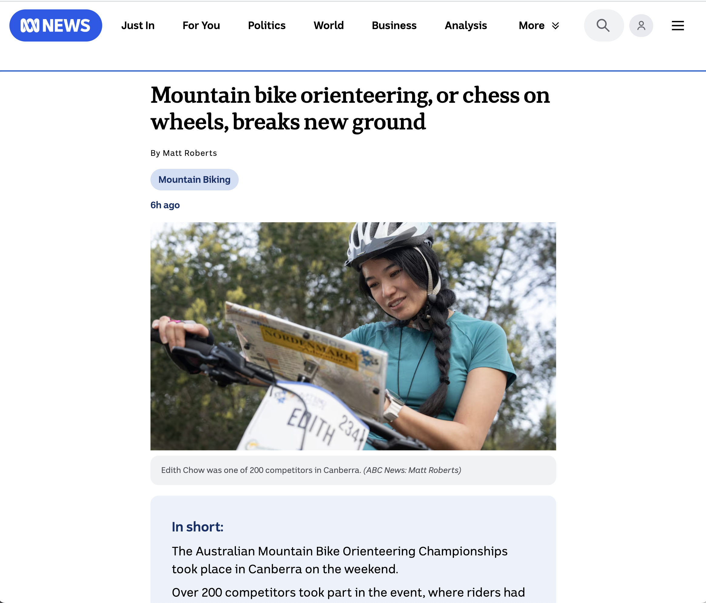
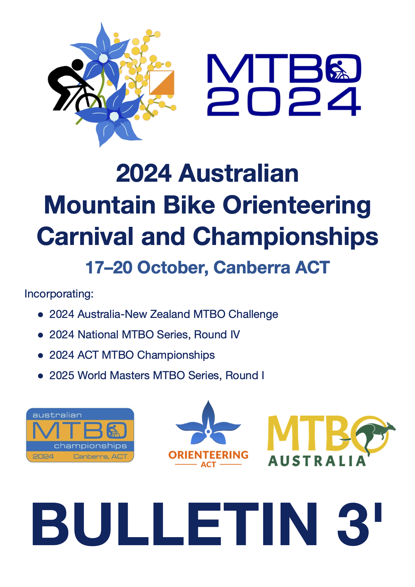
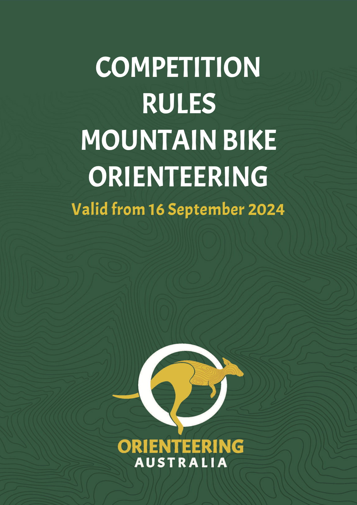
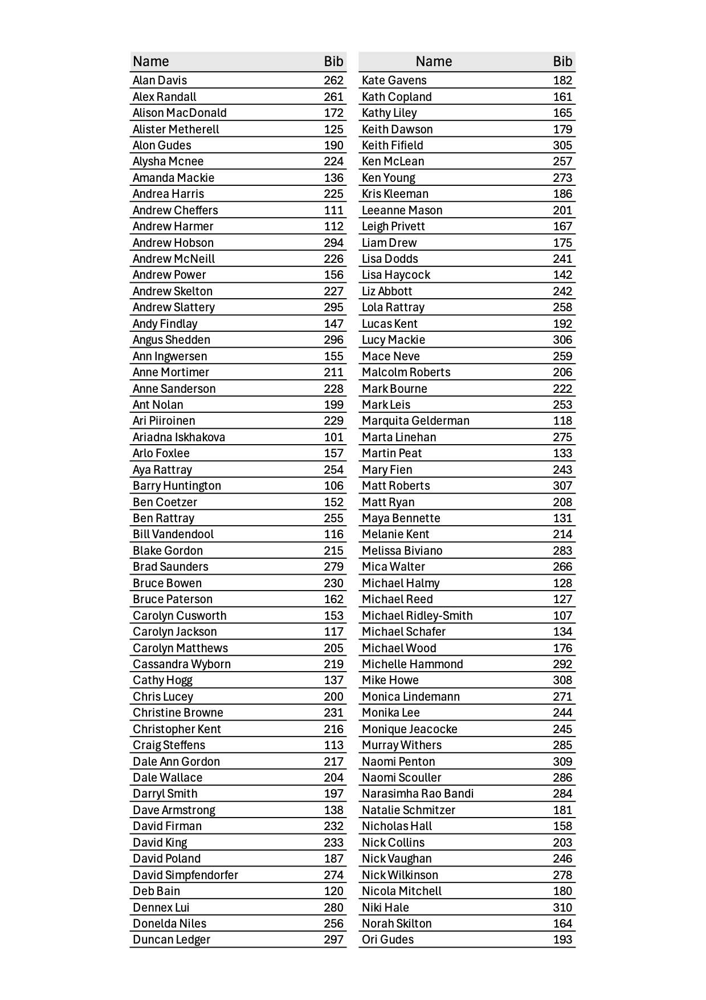
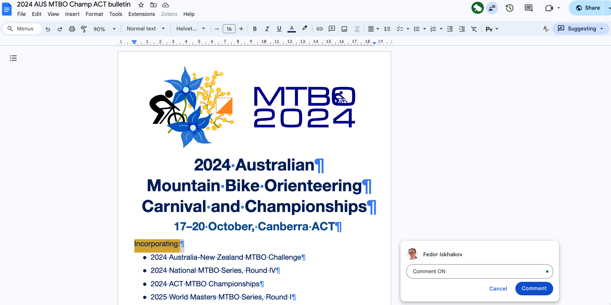
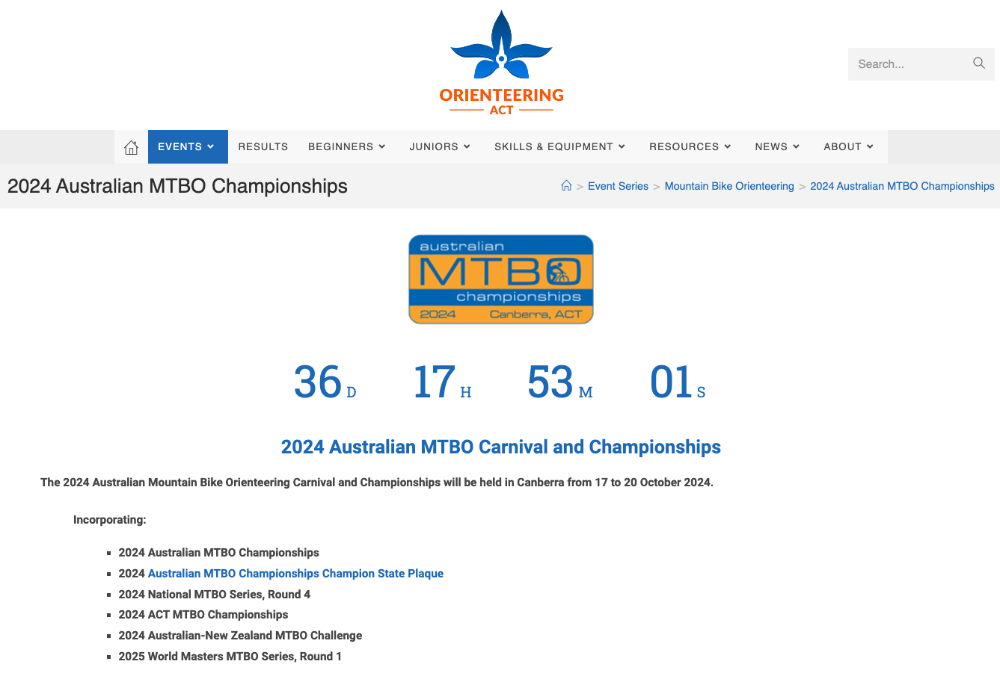
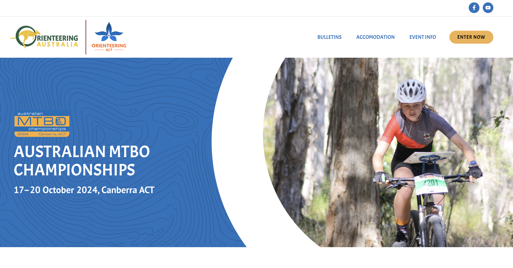
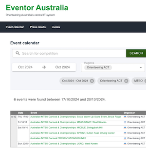

# 📚 Operations manual

This website/document contains the complete information for the organizers and volunteers of the 
***2024 Australian Mountain Bike Orienteering Carnival and Championships***

```{admonition} Past event
:class: caution

This is a document that was used by the organizing team of the 2024 Australian MTBO Championships in ACT. The event is over, and this document is kept for reference purposes.
```

## Results, splits and LiveLox

| Event | Start List| Live Results | Livelox| Official Results |
|-|-|-|-|-|
| E0: Warm-Up | – | <a href="https://liveresultat.orientering.se/followfull.php?lang=en&comp=31547">Live Results</a> | <a href="https://eventor.orienteering.asn.au/Home/RedirectToLivelox?redirectUrl=%2FEvents%2FShow%2F140981">Livelox</a> | <a href="https://eventor.orienteering.asn.au/Events/ResultList?eventId=19686&groupBy=EventClass">Official Results</a> |
| E1: Mass Start| – | <a href="https://liveresultat.orientering.se/followfull.php?lang=en&comp=31548">Live Results</a>  | <a href="https://eventor.orienteering.asn.au/Home/RedirectToLivelox?redirectUrl=%2FEvents%2FShow%2F140982">Livelox</a> | <a href="https://eventor.orienteering.asn.au/Events/ResultList?eventId=19100&groupBy=EventClass">Official Results</a> |
| E2: Middle | <a href="https://eventor.orienteering.asn.au/Events/StartList?eventId=19101&groupBy=EventClass">Start List</a> | <a href="https://liveresultat.orientering.se/followfull.php?comp=31549&lang=en">Live Results</a>  | <a href="https://www.livelox.com/Events/Show/140984/Australian-MTBO-Carnival-Championships-MIDDLE-Stringybark-Hi">Livelox</a> | <a href="https://eventor.orienteering.asn.au/Events/ResultList?eventId=19101&groupBy=EventClass">Official Results</a> |
| E3: Sprint | <a href="https://eventor.orienteering.asn.au/Events/StartList?eventId=19102&groupBy=EventClass">Start List</a> | <a href="https://liveresultat.orientering.se/followfull.php?comp=31551&lang=en">Live Results</a>  | <a href="https://www.livelox.com/Events/Show/140985/Australian-MTBO-Carnival-Championships-SPRINT-Sutton-Road-Dr">Livelox</a> | <a href="https://eventor.orienteering.asn.au/Events/ResultList?eventId=19102&groupBy=EventClass">Official Results</a> |
| E4: Long | <a href="https://eventor.orienteering.asn.au/Events/StartList?eventId=19103&groupBy=EventClass">Start List</a> | <a href="https://liveresultat.orientering.se/followfull.php?comp=31551&lang=sv">Live Results</a>  | <a href="https://eventor.orienteering.asn.au/Home/RedirectToLivelox?redirectUrl=%2FEvents%2FShow%2F140986">Livelox</a> | <a href="https://eventor.orienteering.asn.au/Events/ResultList?eventId=19103&groupBy=EventClass">Official Results</a> |


## Media coverage

::::{grid}
:gutter: 3

:::{grid-item-card} Riotact article
<a href="https://the-riotact.com/the-largest-mountain-bike-carnival-australia-has-ever-seen-is-rolling-into-canberra-and-youre-invited/816200"></a>
:::
:::{grid-item-card} ABC radio interview
<a href="" target=_blank></a>
:::
::::
::::{grid}
:gutter: 3

:::{grid-item-card} ABC News ACT
<a href="https://iview.abc.net.au/video/NU2404C294S00" target=_blank></a>

At `26:19` from the start of `19:00` **ABC News ACT** on `Sunday 20 October 2024`
:::
:::{grid-item-card} ABC article
<a href="https://www.abc.net.au/news/2024-10-21/sport-mountain-bike-orienteering/104497898" target=_blank></a>
:::
::::


## Overall schedule

| **Oct 17, Thursday** | | |
|--|--|--|
| 15:00 | 🎪 Event center opens | [Location](https://maps.app.goo.gl/RkufTrcQbvMn9bMF6) |
| 17:00 - 18:00 | 🚴‍♀️ WARM-UP start window | |
| 19:00 | 🏁 Course closure | |
| 18:30 - 21:30 | 🍷 Social Drinks at *The Verandah* at *Alivio Tourist Park* | [Location](https://maps.app.goo.gl/Wte5veujM1qiDF4T9) |

| **Oct 18, Friday** | | |
|--|--|--|
| 15:00 | 🎪 Event center opens | [Location](https://maps.app.goo.gl/caWZitWLByRsVxT79) |
| 16:30 - 17:00 | 🚴‍♀️ MASS start window | |
| 19:00 | 🏁 Course closure | |
| 18:45 | 🏆 Presentation ceremony for MASS | |

| **Oct 19, Saturday** | | |
|--|--|--|
| 7:30 | 🎪 Event center opens | [Location](https://maps.app.goo.gl/2cXzt4ywia9G6Hj77) |
| 8:30 - 10:00 | 🚴‍♀️ MIDDLE start window | |
| 12:00 | 🏁 Course closure 🏁, arena relocation | |
| 1 pm | 🎪 Event center opens | [Location](https://maps.app.goo.gl/PX7dE2mznda9W7Q49) |
| 14:00 - 15:30 | 🚴‍♀️ SPRINT start window | |
| 16:30 | 🏁 Course closure 🏁 | |
| 18:30 - 21:30 | 🍷 DINNER at *Harmonie German Club* | [Location](https://maps.app.goo.gl/RzJVPCCobYroMax18) |
| 19:30 | 🏆 Presentation ceremony for MIDDLE and SPRINT | |

| **Oct 20, Sunday** | | |
|--|--|--|
| 8:00 | 🎪 Event center opens | [Location](https://maps.app.goo.gl/UvWwtsQ32WtoRC1T6) |
| 9:00 - 10:30 | 🚴‍♀️ LONG start window | |
| 12:30 | 🏆 Presentation ceremony for LONG | |
| 13:30 | 🏁 Course closure | |

See [schedule page](01.schedule.md) for all the details


(home:documents)=
## Main documents

::::{grid}
:gutter: 3

:::{grid-item-card} Bulletin 3 (final updates)
<a href="_static/pdf/bulletin3prime.pdf"></a>
:::
:::{grid-item-card} Competition rules
<a href="_static/pdf/209-2024MountainBikeOrienteeringCompetitionRules-OperationsGuideEd6.pdf"></a>
:::
:::{grid-item-card} Bib numbers
<a href="_static/lists/bibs.pdf"></a>
:::
::::

## Links to web pages

::::{grid}
:gutter: 3

:::{grid-item-card} Comments to Bulletin 3
<a href="https://docs.google.com/document/d/1wwht_mry4evapyWD3GVPYX5D3rnNsPMb9IQBj2Z0tBk/edit?usp=sharing"></a>
:::
:::{grid-item-card} @ OACT
<a href="https://act.orienteering.asn.au/event-series/mountain-bike-orienteering/2024-australian-mtbo-championships/" target=_blank></a>
:::
:::{grid-item-card} @ Orienteering Australia
<a href="https://ausmtbochamps2024.orienteering.asn.au/" target=_blank></a>
:::
::::

## Links to Eventor pages

::::{grid}
:gutter: 2

:::{grid-item-card} WARMUP
<a href="https://eventor.orienteering.asn.au/Events/Show/19686" target=_blank></a>
:::
:::{grid-item-card} MASS
<a href="https://eventor.orienteering.asn.au/Events/Show/19100" target=_blank></a>
:::
:::{grid-item-card} MIDDLE
<a href="https://eventor.orienteering.asn.au/Events/Show/19101" target=_blank></a>
:::
:::{grid-item-card} SPRINT
<a href="https://eventor.orienteering.asn.au/Events/Show/19102" target=_blank></a>
:::
:::{grid-item-card} DINNER
<a href="https://eventor.orienteering.asn.au/Events/Show/19687" target=_blank></a>
:::
:::{grid-item-card} LONG
<a href="https://eventor.orienteering.asn.au/Events/Show/19103" target=_blank></a>
:::
::::


(home:toc)=
## Operations manual sections

```{tableofcontents}
```

(home:contacts)=
## Emergency contacts

- **Marina Iskhakova** - Event Director - `0412308310`
- **Fedor Iskhakov** - Technical Director - `0434019571`
- [Organizing team WhatsApp group](https://chat.whatsapp.com/FrbzM8oWHClJEl05EylQBj)

---

This website is made using [Jupyter Book](https://jupyterbook.org/en/stable/intro.html) and is hosted by [Github](https://github.com/fediskhakov/mtbo2024champ)
