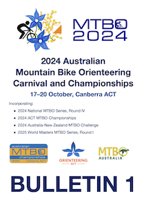
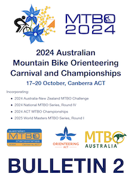
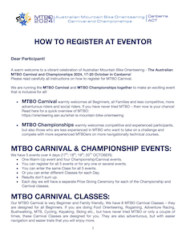

# 📚 Operations manual

This website/document contains the complete information for the organizers and volunteers of the

***2024 Australian Mountain Bike Orienteering Carnival and Championships***

## Overall schedule

| **Oct 17, Thursday** | | |
|--|--|--|
| 15:00 | 🎪 Event center opens | [Location](https://maps.app.goo.gl/RkufTrcQbvMn9bMF6) |
| 17:00 - 18:00 | 🚴‍♀️ WARM-UP start window | |
| 19:00 | 🏁 Course closure | |
| 18:30 - 21:30 | 🍷 Social Drinks at *The Verandah* at *Alivio Tourist Park* | [Location](https://maps.app.goo.gl/Wte5veujM1qiDF4T9) |

| **Oct 18, Friday** | | |
|--|--|--|
| 15:00 | 🎪 Event center opens | [Location](https://maps.app.goo.gl/caWZitWLByRsVxT79) |
| 16:30 - 17:00 | 🚴‍♀️ MASS start window | |
| 19:00 | 🏁 Course closure | |
| 18:45 | 🏆 Presentation ceremony for MASS | |

| **Oct 19, Saturday** | | |
|--|--|--|
| 7:30 | 🎪 Event center opens | [Location](https://maps.app.goo.gl/2cXzt4ywia9G6Hj77) |
| 8:30 - 10:00 | 🚴‍♀️ MIDDLE start window | |
| 12:00 | 🏁 Course closure 🏁, arena relocation | |
| 1 pm | 🎪 Event center opens | [Location](https://maps.app.goo.gl/PX7dE2mznda9W7Q49) |
| 14:00 - 15:30 | 🚴‍♀️ SPRINT start window | |
| 16:30 | 🏁 Course closure 🏁 | |
| 18:30 - 21:30 | 🍷 DINNER at *Harmonie German Club* | [Location](https://maps.app.goo.gl/RzJVPCCobYroMax18) |
| 19:30 | 🏆 Presentation ceremony for MIDDLE and SPRINT | |

| **Oct 20, Sunday** | | |
|--|--|--|
| 8:00 | 🎪 Event center opens | [Location](https://maps.app.goo.gl/UvWwtsQ32WtoRC1T6) |
| 9:00 - 10:30 | 🚴‍♀️ LONG start window | |
| 12:30 | 🏆 Presentation ceremony for LONG | |
| 13:30 | 🏁 Course closure | |

See [schedule page](01.schedule.md) for all the details

## Main documents

::::{grid}
:gutter: 3

:::{grid-item-card} Bulletin 1

:::
:::{grid-item-card} Bulletin 2

:::
:::{grid-item-card} How to register

:::
::::

## Links to web pages

::::{grid}
:gutter: 4

:::{grid-item-card} @ OACT

:::
:::{grid-item-card} @ Orienteering Australia

:::
::::

## Links to Eventor pages

::::{grid}
:gutter: 4

:::{grid-item-card} WARMUP

:::
:::{grid-item-card} MASS

:::
:::{grid-item-card} MIDDLE

:::
:::{grid-item-card} SPRINT

:::
:::{grid-item-card} DINNER

:::
:::{grid-item-card} LONG

:::
::::

## Emergency contacts

- **Marina Iskhakova** - Event Director - `0412308310`
- **Fedor Iskhakov** - Technical Director - `0434019571`
- [Organizing team WhatsApp group](https://chat.whatsapp.com/FrbzM8oWHClJEl05EylQBj)

---

This website is made using [Jupyter Book](https://jupyterbook.org/en/stable/intro.html) and is hosted by [Github](https://github.com/fediskhakov/mtbo2024champ)
